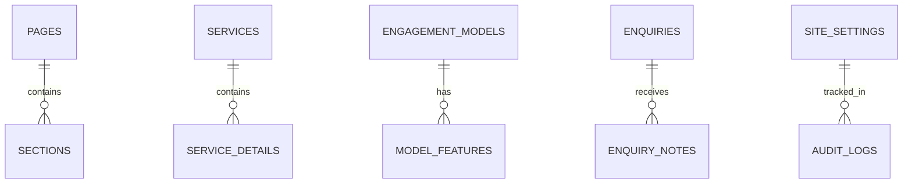

# Database Schema Design - Thinkers Mind (Content-Driven)

An enterprise-grade, content-driven schema designed for **PostgreSQL**. This schema enables full administrative control over pages, layouts, services, and global brand settings.

## Entity Relationship Overview

## Table Definitions

### 1. Site Structure & Layout

#### `Pages`
| Column | Type | Constraints | Description |
| :--- | :--- | :--- | :--- |
| `id` | UUID | PK | Unique identifier |
| `slug` | VARCHAR(100) | UNIQUE, NOT NULL | URL path (e.g., 'home', 'about') |
| `title` | VARCHAR(255) | NOT NULL | Page title |
| `is_active` | BOOLEAN | DEFAULT TRUE | Visibility toggle |

#### `Sections`
| Column | Type | Constraints | Description |
| :--- | :--- | :--- | :--- |
| `id` | UUID | PK | Unique identifier |
| `page_id` | UUID | FK -> Pages.id | Parent page |
| `type` | VARCHAR(50) | NOT NULL | Section style (e.g., 'Hero', 'Grid') |
| `content` | JSONB | NOT NULL | Section-specific data (JSON) |
| `sort_order` | INT | DEFAULT 0 | Layout sequence |

---

### 2. CMS (Dynamic Content)

#### `Services`
| Column | Type | Constraints | Description |
| :--- | :--- | :--- | :--- |
| `id` | UUID | PK | Unique identifier |
| `title` | VARCHAR(255) | NOT NULL | Service name |
| `tagline` | TEXT | | Strategic messaging |
| `icon_name` | VARCHAR(50) | | Lucide icon identifier |
| `description` | TEXT | | Detailed service bio |

#### `EngagementModels`
| Column | Type | Constraints | Description |
| :--- | :--- | :--- | :--- |
| `id` | UUID | PK | Unique identifier |
| `title` | VARCHAR(255) | NOT NULL | Model name (e.g., 'Full-time') |
| `icon_name` | VARCHAR(50) | | Lucide icon identifier |
| `description` | TEXT | | Summary of the model |
| `features` | JSONB | | List of benefits |

---

### 3. Global Control

#### `SiteSettings`
| Column | Type | Constraints | Description |
| :--- | :--- | :--- | :--- |
| `id` | UUID | PK | Unique identifier |
| `key` | VARCHAR(100) | UNIQUE, NOT NULL | e.g., 'primary_tagline', 'cta_text' |
| `value` | TEXT | NOT NULL | Setting value |
| `category` | VARCHAR(50) | | e.g., 'Hero', 'Footer' |

#### `ServiceDetails`
| Column | Type | Constraints | Description |
| :--- | :--- | :--- | :--- |
| `id` | UUID | PK | Unique identifier |
| `service_id` | UUID | FK -> Services.id | Parent service |
| `type` | VARCHAR(50) | NOT NULL | 'HowWeWork', 'Outcome', 'Deliverable' |
| `content` | TEXT | NOT NULL | The list item text |
| `sort_order` | INT | DEFAULT 0 | Display sequence |

#### `ExportProducts`
| Column | Type | Constraints | Description |
| :--- | :--- | :--- | :--- |
| `id` | UUID | PK | Unique identifier |
| `name` | VARCHAR(255) | NOT NULL | e.g., 'Moringa Powder' |
| `description` | TEXT | | Product bio |
| `sourcing_vision`| TEXT | | DOCUMENTATION: Our approach |
| `image_url` | TEXT | | Path to product visual |

---

### 3. Lead Management (CRM)

#### `Enquiries`
| Column | Type | Constraints | Description |
| :--- | :--- | :--- | :--- |
| `id` | UUID | PK | Unique identifier |
| `full_name` | VARCHAR(255) | NOT NULL | Lead name |
| `email` | VARCHAR(255) | NOT NULL | Contact email |
| `company` | VARCHAR(255) | | Lead organization |
| `service_interest`| VARCHAR(100) | | Related service category |
| `message` | TEXT | | Detailed enquiry text |
| `status_id` | UUID | FK -> EnquiryStatuses.id | Current workflow stage |
| `created_at` | TIMESTAMP | DEFAULT NOW() | Submission time |

#### `EnquiryStatuses`
| Column | Type | Constraints | Description |
| :--- | :--- | :--- | :--- |
| `id` | UUID | PK | Unique identifier |
| `name` | VARCHAR(50) | NOT NULL | e.g., 'New', 'Quoted', 'Converted' |
| `color_hex` | VARCHAR(7) | | UI label color |

---

### 4. Logs & Security

#### `AuditLogs`
| Column | Type | Constraints | Description |
| :--- | :--- | :--- | :--- |
| `id` | BIGSERIAL | PK | Unique identifier |
| `user_id` | UUID | FK -> Users.id | Performer |
| `action` | VARCHAR(255) | NOT NULL | e.g., 'UPDATE_SERVICE' |
| `metadata` | JSONB | | Old/New value diff |
| `created_at` | TIMESTAMP | DEFAULT NOW() | Timestamp |

## Design Rationale

1.  **JSONB for Permissions**: Allows flexible role expansion without table migrations.
2.  **Relational Service Details**: Moving "How We Work" and "Outcomes" to a separate table `ServiceDetails` ensures specific list items can be edited/ordered individually.
3.  **UUIDs**: Use of UUIDs prevents ID enumeration and facilitates easier record merging from different environments.
4.  **Audit Logs**: Essential for enterprise transparency, especially when multiple admins manage trade and tech content.
